<p align="center">
  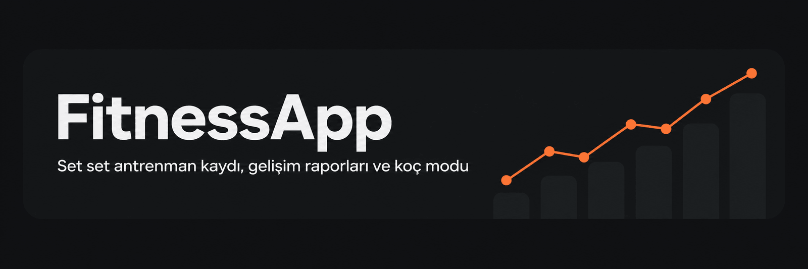
</p>

<p align="center">
  <b>Spor salonunda set set antrenman kaydı tutan sporcular ve danışanlarını uzaktan takip eden koçlar için bir antrenman takip uygulaması.</b>
</p>

<p align="center">
  
  
  
  
  
  
  
</p>

<p align="center">
  <a href="#canlı-demo">Canlı demo</a> ·
  <a href="#neden-fitnessapp">Neden</a> ·
  <a href="#özellikler">Özellikler</a> ·
  <a href="#açık-ve-koyu-tema-mobil-görünüm">Tema ve mobil</a> ·
  <a href="#tasarım">Tasarım</a> ·
  <a href="#teknik-kararlar">Teknik kararlar</a> ·
  <a href="#teknoloji">Teknoloji</a> ·
  <a href="#yerelde-çalıştırma">Yerelde çalıştırma</a> ·
  <a href="#geliştiren">İletişim</a>
</p>

## Canlı demo

<p align="center">
  
  <br><sub>Demo hesabıyla giriş → ana sayfa → raporlar → danışan çalışma alanı → programlar. Kayıt canlı siteden alındı (<a href="docs/media/live-demo.mp4">MP4</a>).</sub>
</p>

**[fitnessapp.salihsydm.com](https://fitnessapp.salihsydm.com)** adresinde giriş ekranındaki **Demo hesabıyla dene**'ye bas:

- Kayıt gerekmez. Her ziyaretçiye ayrı bir hesap açılır; başkasının yaptığı değişiklik seninkini etkilemez.
- Hesap dolu gelir: 12 haftalık itiş / çekiş / bacak geçmişi, kişisel rekorlar, dört program, bir özel hareket ve haftalık vücut ölçümleri.
- Koç modu açıktır. İki danışanın vardır: biri koçun atadığı programla çalışıyor ve bazı antrenmanlarını koç girmiş, diğeri kendi programını izliyor.
- Hesap 24 saat sonra kendiliğinden silinir.

Aşağıdaki GIF'ler de canlı sitede demo hesabıyla, ekran görüntüleri ise sentetik veriyle yerelde çalışan uygulamada alındı.

## Neden FitnessApp

Salonda çoğu kişi kaldırdığı ağırlığı telefon notlarına ya da deftere yazar. Bir sonraki antrenmanda geçen sefer kaç kilo, kaç tekrar yaptığını bulmak için notları karıştırır, rekor kırıp kırmadığını da tahmin eder. Haftalar geçtikçe hangi hareketin ilerlediği, hangi kas grubunun ihmal edildiği görünmez olur. Uzaktan çalışan bir koç ise danışanının gerçekte ne yaptığını ancak ekran görüntüleriyle öğrenebilir.

FitnessApp her hareketi set set (ağırlık × tekrar) kaydeder. Giriş formu son antrenmanın setleriyle dolu açılır; aynı antrenmanı tekrarlıyorsan tek dokunuşla kaydedersin. Yeni rekor kaydederken kutlama olarak gösterilir, raporlar gelişimi ve kas grubu dağılımını hesaplar. Koç, davet koduyla bağlandığı danışanının geçmişini ve raporlarını görür, onun adına antrenman girer ya da program atar.

## Özellikler

### Antrenman kaydı

<p align="center">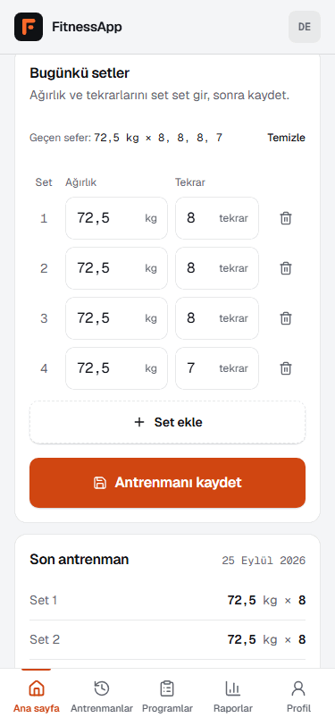</p>

- Giriş formu son antrenmanın setleriyle (aynı ağırlık, tekrar ve set sayısı) dolu açılır; üstünde `Geçen sefer: 72,5 kg × 8, 8, 8, 7` özeti durur, `Temizle` formu boşaltır.
- Kaydedilen set o hareketteki en ağır seti geçerse "Yeni kişisel rekor" kartı önceki rekorla birlikte gösterilir; destekleyen telefonlarda farklı bir titreşim deseni çalar.
- Kayıttan sonra isteğe bağlı dinlenme sayacı: 60, 90, 120 veya 180 saniye, `+15 sn` ve `Atla`. Kalan süre bitiş zamanından hesaplandığı için sekme arka plandayken de doğru kalır; süre bitince titreşir.
- Geçmişteki her kayıt kartın içinde düzenlenir veya satır içi onayla silinir.
- 8 kas grubunda 125 hareketlik bir kütüphane; kütüphanedeki hareketler kişiye özel yeniden adlandırılabilir, gizlenebilir, eksik olan için özel hareket eklenebilir.

<table>
  <tr>
    <td width="50%"></td>
    <td width="50%">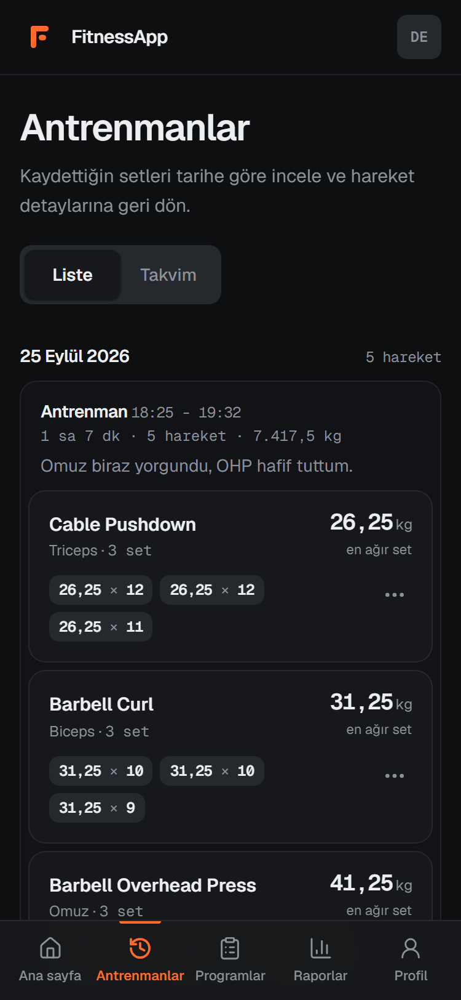</td>
  </tr>
  <tr>
    <td><sub>Form son antrenmanın dört setiyle dolu açılıyor; ağırlık ve tekrar kutuları 375 px genişlikte yatay kaydırma olmadan sığıyor.</sub></td>
    <td><sub>Geçmiş gün gün, gün içinde oturum oturum gruplanıyor: saat aralığı, süre, hareket sayısı, toplam hacim ve oturum notu başlıkta.</sub></td>
  </tr>
</table>

### Oturumlar, programlar ve takvim

<p align="center">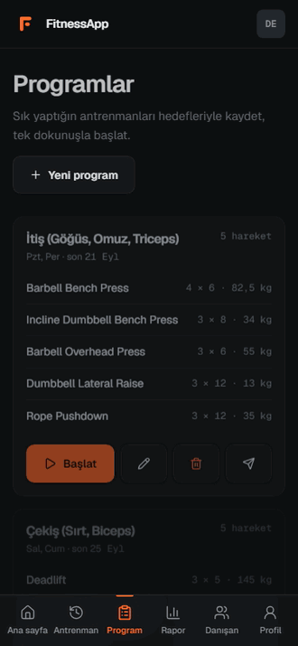</p>

- `Antrenmana başla` bir oturum açar; o sırada kaydedilen her hareket bu oturuma eklenir. Oturum çubuğu her sayfada geçen süreyi ve hareket sayısını gösterir.
- Programlar (hareket, hedef set × tekrar, isteğe bağlı hedef ağırlık, haftanın günleri) tek dokunuşla başlatılır. Program oturumunda giriş formu plan hedefiyle dolar, oturum çubuğundaki liste yapılan hareketleri işaretler.
- Başlat tuşuna iki kez basmak ikinci bir oturum açmaz; açık unutulan oturum 6 saat sonra son kaydın saatinde kendiliğinden kapanır.
- Takvimde antrenman yapılan günler dolu, programa göre planlanan günler kesikli çerçeveyle görünür; bir güne dokununca o günün özeti açılır.

<table>
  <tr>
    <td width="50%">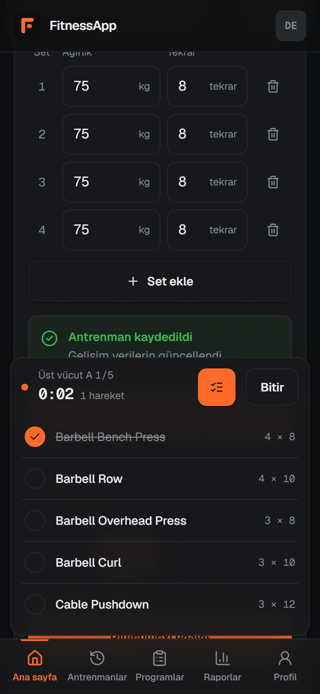</td>
    <td width="50%">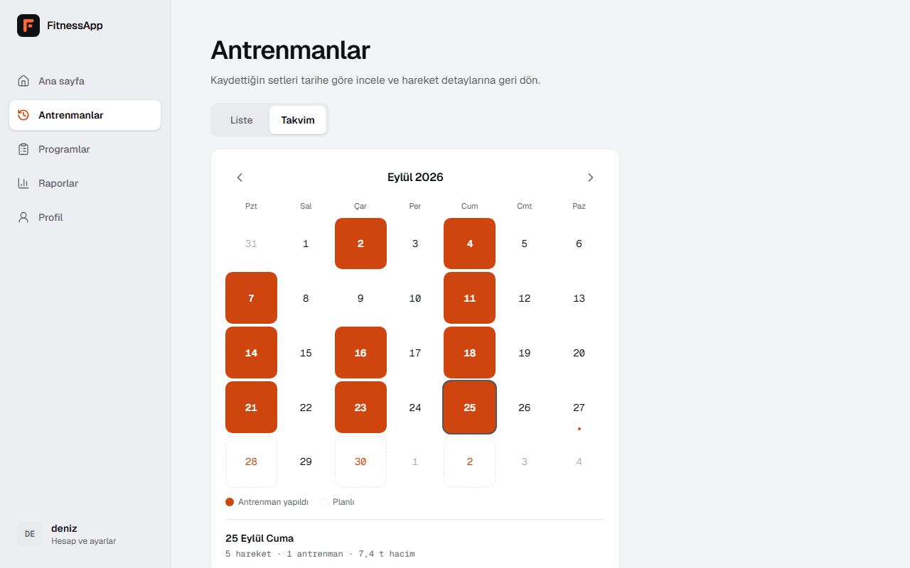</td>
  </tr>
  <tr>
    <td><sub>İlk hareket kaydedilince plan listesinde üstü çiziliyor; sayaç "Üst vücut A 1/5" olarak ilerliyor.</sub></td>
    <td><sub>Eylül: Pazartesi, Çarşamba ve Cuma dolu; 9 Eylül atlanmış. Önümüzdeki planlı günler kesikli çerçeveli.</sub></td>
  </tr>
  <tr>
    <td colspan="2">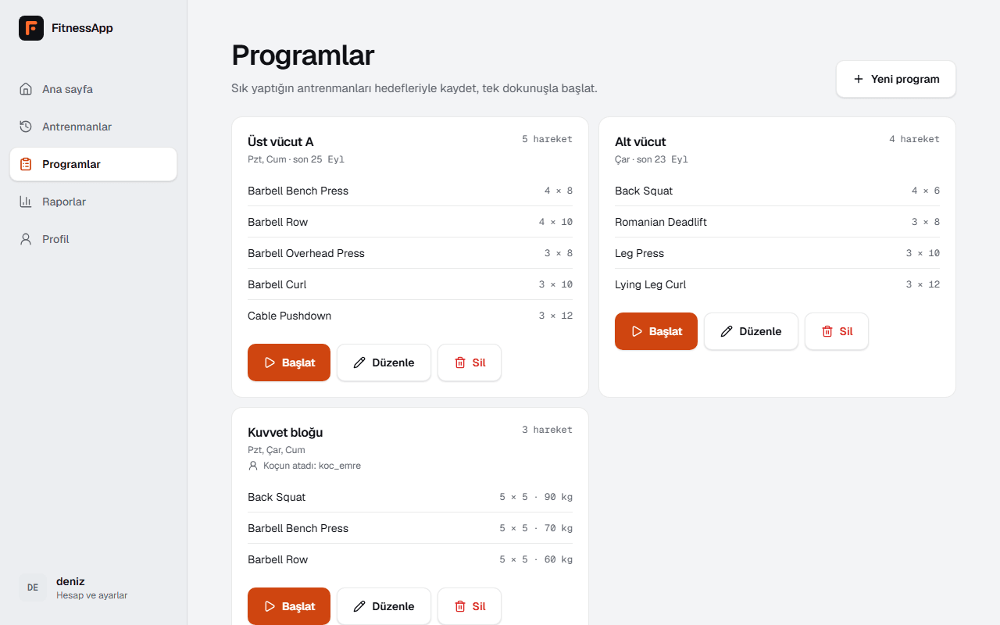<br><sub>Kendi programlarının yanında koçun atadığı "Kuvvet bloğu", hedef ağırlıklarıyla ve "Koçun atadı" etiketiyle listeleniyor.</sub></td>
  </tr>
</table>

### Raporlar

<p align="center">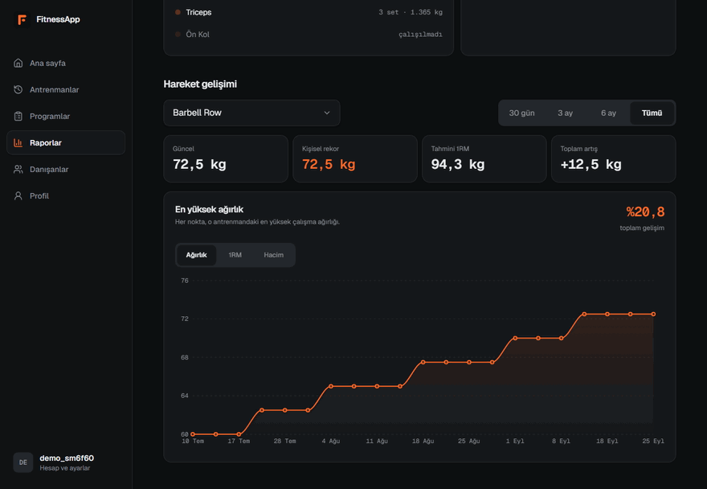</p>

- Son 7 gün: antrenman günü, toplam hacim ve önceki 7 güne göre değişim; üst üste antrenman yapılan hafta sayısı.
- Kas grubu ısı haritası: son 7 günün hacmi anatomi çizimi üzerinde renklendirilir. Renk tek başına bilgi taşımasın diye altında set ve hacim listesi de vardır.
- Son 5 kişisel rekor, önceki rekorla birlikte.
- Hareket bazında grafik: en yüksek ağırlık, tahmini 1RM (Epley: `ağırlık × (1 + tekrar / 30)`) ve hacim; 30 gün, 3 ay, 6 ay ya da tüm zaman.

<table>
  <tr>
    <td width="50%">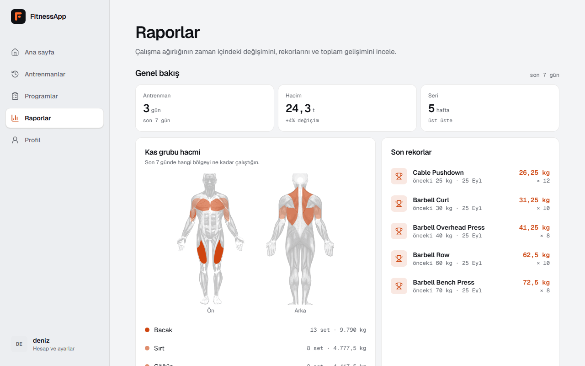</td>
    <td width="50%">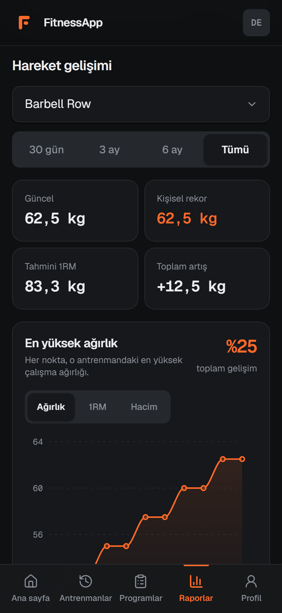</td>
  </tr>
  <tr>
    <td><sub>Bu hafta en çok bacak çalışılmış (koyu turuncu); sağda son rekorlar önceki değerleriyle.</sub></td>
    <td><sub>Özet kartları: güncel, rekor, tahmini 1RM ve toplam artış; yalnızca rekor vurgu rengiyle gösteriliyor.</sub></td>
  </tr>
</table>

### Koç ve danışan modu

<p align="center">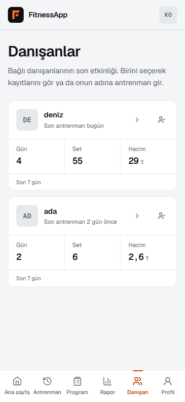</p>

- Her hesap profilinden koç modunu açabilir; ayrı bir koç hesabı yoktur. Koç 8 karakterlik davet kodunu (karışabilecek 0/O ve 1/I yok) ya da bağlantısını paylaşır, danışan koçun ne görebileceğini okuyup kabul eder.
- Koçun "Danışanlar" sayfası her danışanın son antrenmanını ve son 7 günün gün, set ve hacim özetini gösterir.
- Danışan çalışma alanında koç, uygulamanın kendi Raporlar ve Antrenmanlar ekranlarını danışanın verisiyle görür ve onun adına antrenman girer.
- Koçun girdiği kayıtlar "Koçun girdi" diye işaretlenir. Koç yalnızca kendi girdiği kayıtları düzenleyebilir, danışanın kendi kayıtlarına dokunamaz.
- Koç bir programını danışana atar; danışana bağımsız bir kopya gider.
- Bağlantıyı iki taraf da istediği an koparır; koçun erişimi hemen kapanır, girdiği kayıtlar danışanda kalır.

<table>
  <tr>
    <td width="50%">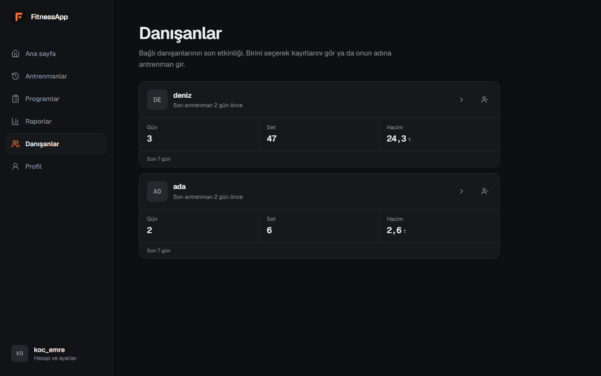</td>
    <td width="50%">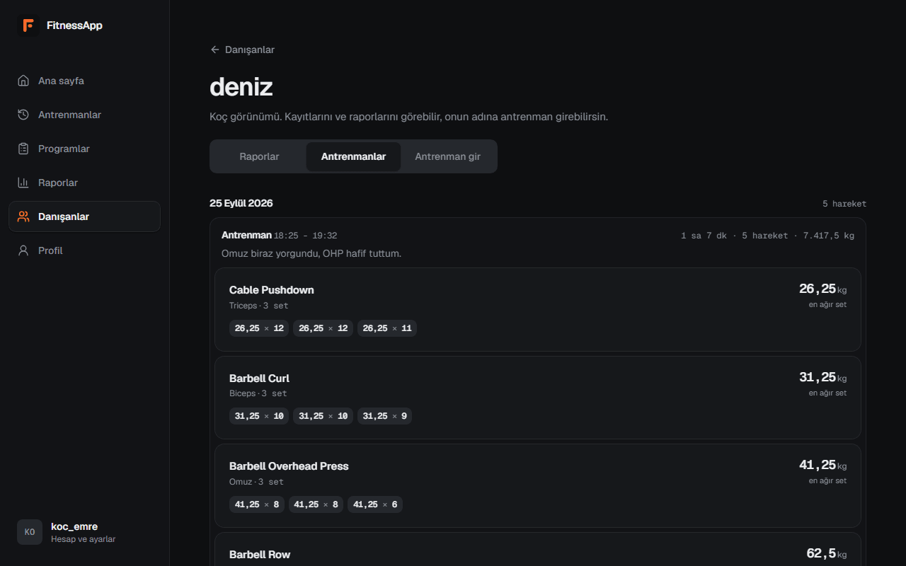</td>
  </tr>
  <tr>
    <td><sub>İki danışan, son etkinliğe göre sıralı; kartın altında son 7 günün özeti.</sub></td>
    <td><sub>Koç, danışanın geçmişini salt okunur görüyor: danışanın kendi kayıtlarında düzenleme menüsü yok.</sub></td>
  </tr>
  <tr>
    <td>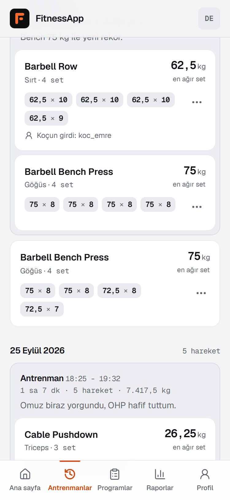</td>
    <td>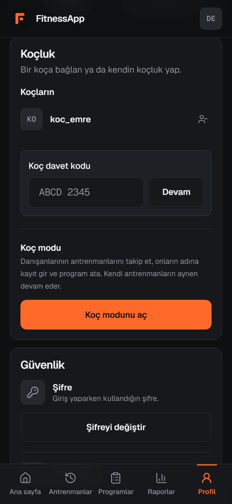</td>
  </tr>
  <tr>
    <td><sub>Danışan tarafı: koçun girdiği Barbell Row kaydının altında "Koçun girdi: koc_emre".</sub></td>
    <td><sub>Profildeki Koçluk bölümü: bağlı koçlar, davet kodu girişi ve koç modunu açma.</sub></td>
  </tr>
</table>

### Profil ve hesap

<p align="center">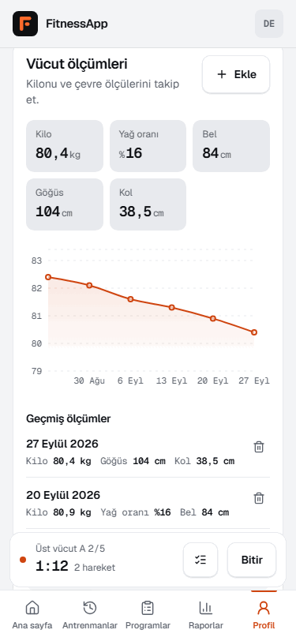</p>

- Vücut ölçümleri: kilo, yağ oranı, bel, göğüs ve kol; son değerler, kilo grafiği ve geçmiş liste.
- kg / lb seçimi: veri her zaman kilogram olarak saklanır, seçilen birim yalnızca gösterimi ve girişi değiştirir (1 lb = 0,45359237 kg).
- Bütün setleri CSV olarak indirme (tarih, hareket, kas grubu, set, ağırlık, tekrar, oturum başlangıcı ve notu).
- Şifre değiştirme; diğer cihazlardaki açık oturum sayısını görme ve onlardan çıkış.
- Hesap silme: mevcut şifre ve `hesabımı sil` yazmak gerekir; öncesinde CSV indirme önerilir.

<table>
  <tr>
    <td width="50%">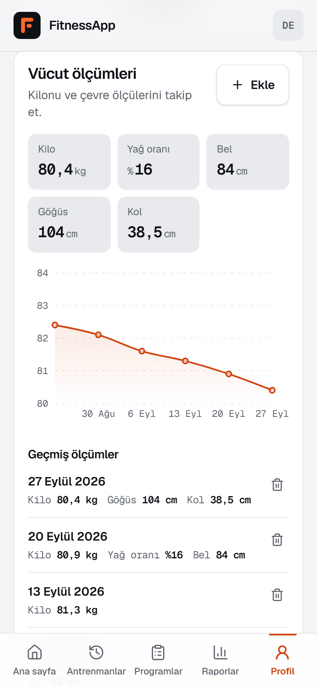</td>
    <td width="50%">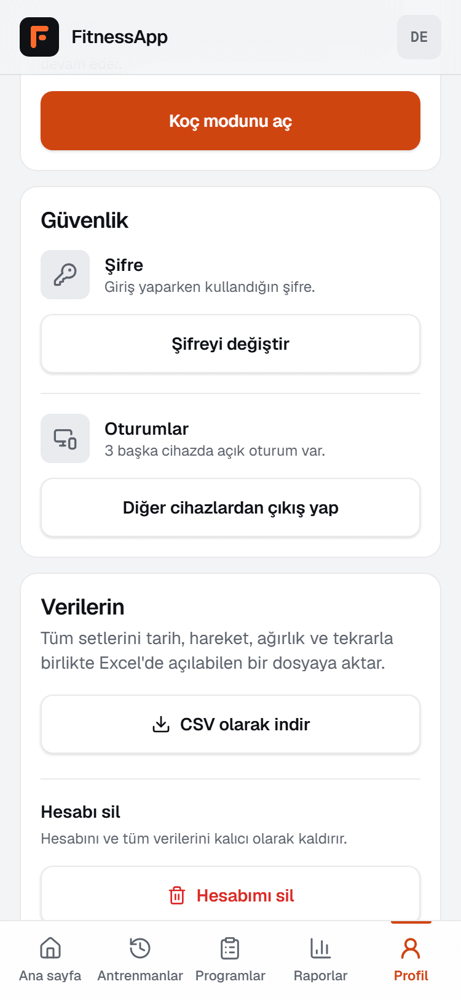</td>
  </tr>
  <tr>
    <td><sub>Beş haftalık tartı: 82,4 kg'dan 80,4 kg'a. Her ölçü, onu içeren en son kayıttan alınıyor.</sub></td>
    <td><sub>Diğer cihazlarda 3 açık oturum; tek dokunuşla kapatılabiliyor. Altında CSV ve hesap silme.</sub></td>
  </tr>
</table>

## Açık ve koyu tema, mobil görünüm

Tema sistem ayarını izler ya da elle seçilir; seçim ilk çizimden önce uygulandığı için sayfa yüklenirken beyaz bir parlama olmaz. Uygulama telefona yüklenebilen bir PWA'dır.

<table>
  <tr>
    <td width="50%">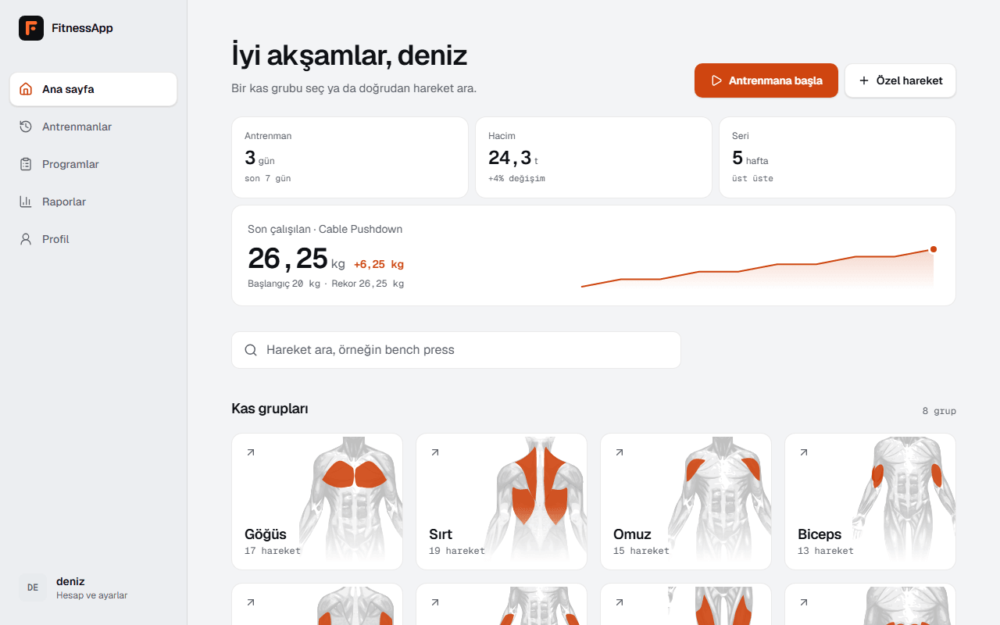</td>
    <td width="50%">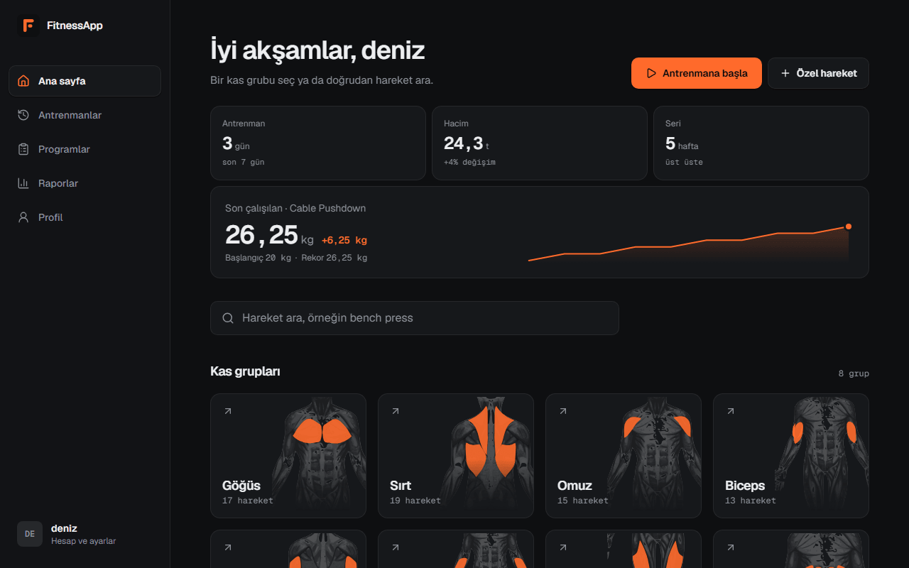</td>
  </tr>
  <tr>
    <td>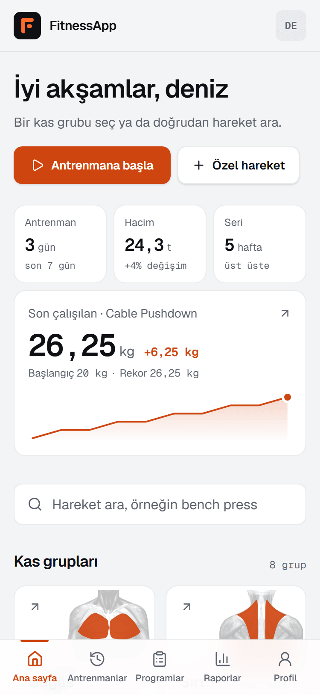</td>
    <td>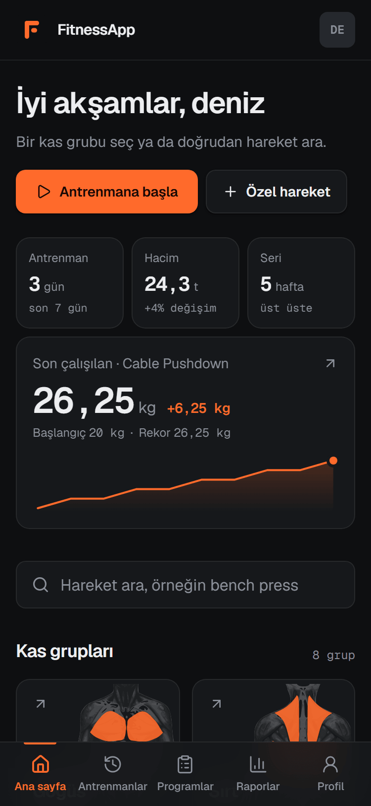</td>
  </tr>
  <tr>
    <td colspan="2"><sub>Aynı ekranın dört hâli. Masaüstünde sol menü, mobilde alt menü; iki temada da hiyerarşi ve vurgu rengi aynı. Mobil görüntüler 375 px genişlikte alındı.</sub></td>
  </tr>
</table>

## Tasarım


Tasarım dili "Precision": soğuk grafit tonlar, tek bir turuncu vurgu ve sayılar için eş aralıklı yazı. Logo, kayıt ekranındaki set satırlarına gönderme yapan yuvarlak uçlu çubuklardan kurulu bir "F"; aynı SVG favicon ve PWA ikonu olarak da kullanılıyor.

| Token            | Açık      | Koyu      | Kullanım                                                |
| ---------------- | --------- | --------- | ------------------------------------------------------- |
| `background`     | `#f3f4f6` | `#0e0f11` | Uygulama zemini                                         |
| `surface`        | `#ffffff` | `#16181b` | Kartlar, girişler, menüler                              |
| `primary`        | `#cf4510` | `#ff6a2b` | Tek vurgu: ana eylem, aktif menü, rekor, grafik çizgisi |
| `text-primary`   | `#0f1115` | `#edeef0` | Başlıklar ve değerler                                   |
| `text-secondary` | `#5d636d` | `#8b909a` | Açıklamalar, birimler                                   |

- Açık temadaki vurgu rengi daha koyu: turuncu yazı beyaz zeminde, beyaz yazı turuncu zeminde WCAG AA kontrastını geçsin diye.
- Yazı tipleri: metin için [Geist](https://vercel.com/font), ağırlık, tekrar ve tarihler için tablo hizalı rakamlarla Geist Mono.
- Hareket yalnızca sıralamayı, durum değişikliğini ya da geri bildirimi anlatmak için kullanılıyor; `prefers-reduced-motion` açıkken kaldırılıyor.
- Bütün kurallar ve token'lar: [docs/design-system.md](docs/design-system.md).

## Teknik kararlar

**Ağırlıklar tam sayı hassasiyetinde.** Setler MySQL `DECIMAL(6,2)` olarak saklanır; 22,75 kg kayan nokta hatası olmadan tutulur ([schema.prisma](apps/api/prisma/schema.prisma)). Hacim ve rekor karşılaştırmaları sunucuda kilogramın yüzde biri cinsinden tam sayılarla (`BigInt`) yapılır, böylece toplamlar yuvarlama biriktirmez ([weight-math.ts](apps/api/src/reports/weight-math.ts)). lb dönüşümü yalnızca istemcide, tek bir modülde yapılır; saklanan kilogram hiçbir zaman değişmez ([format.ts](apps/web/src/lib/format.ts)).

**Oturum güvenliği.** Şifreler argon2id ile saklanır. Kısa ömürlü erişim token'ı yalnızca bellekte tutulur, `localStorage`'a yazılmaz. Yenileme token'ı yalnızca `/api/auth` yoluna gönderilen `HttpOnly`, `SameSite=Lax` bir cookie'dedir; veritabanında yalnızca SHA-256 özeti durur ve her kullanımda yenisiyle değiştirilir. Şifre değişince o cihaz dışındaki bütün oturumlar kapatılır ([auth.service.ts](apps/api/src/auth/auth.service.ts), [auth.config.ts](apps/api/src/auth/auth.config.ts), [auth-provider.tsx](apps/web/src/auth/auth-provider.tsx)).

**Sahiplik her sorguda.** Kullanıcı kimliği her zaman doğrulanmış token'dan gelir; istek gövdesinden alınmaz. Kayıt, oturum, program ve ölçüm sorguları `id` ile birlikte `userId` ile filtrelenir. Başka kullanıcının kaydı için 403 değil 404 döner, böylece kaydın var olup olmadığı sızmaz ([exercise-logs.service.ts](apps/api/src/exercise-logs/exercise-logs.service.ts)). Koç erişimini tek bir guard denetler: bağlantı yoksa danışan uç noktaları 404 döner ([linked-client.guard.ts](apps/api/src/coach/linked-client.guard.ts)).

**Eşzamanlılık ve çakışmalar.**

- Kullanıcı başına tek aktif oturum: MySQL'de kısmi unique index olmadığı için oturum başlatma, kullanıcı satırını `SELECT … FOR UPDATE` ile kilitleyen bir transaction içinde yapılır. Aynı anda iki başlat isteği ikinci bir oturum açamaz, ikincisi mevcut oturumu döner ([sessions.service.ts](apps/api/src/sessions/sessions.service.ts)).
- Bir kayıt ve setleri tek transaction'da yazılır; yarım kalmış bir antrenman kaydı oluşamaz. Düzenleme de setleri tek transaction'da değiştirir.
- Davet kabulü `(coachId, clientId)` unique kısıtına dayanır: iki kez kabul etmek hata değil, mevcut bağlantıyı döner. Davet kodu çakışırsa yeni kod üretilir ([coach.service.ts](apps/api/src/coach/coach.service.ts)).

**Geçmiş korunur.** Kullanıcı verisi ilişkilerinde `RESTRICT` kullanılır; oturum, program ve "kim girdi" bağlantılarında `SET NULL`. Bir program ya da koç hesabı silinse de antrenman kayıtları kalır. Her şeyi silen tek akış hesap silmedir: bağımlılık sırasıyla tek transaction'da, açıkça yazılmış adımlarla çalışır ([users.service.ts](apps/api/src/users/users.service.ts), [docs/database.md](docs/database.md)).

**Doğrulama iki katmanda.** API'de global `ValidationPipe` tanımsız alanları reddeder ve DTO'lar `class-validator` ile tanımlıdır ([main.ts](apps/api/src/main.ts)). İstemci aynı kuralları, birim testleri olan saf fonksiyonlarla anında gösterir ([workout-validation.ts](apps/web/src/lib/workout-validation.ts), [measurement-form.ts](apps/web/src/lib/measurement-form.ts)).

**Saat dilimi istemciden.** "Son 7 gün", hafta serisi ve takvim günleri, istemcinin UTC farkıyla hesaplanır; gece yarısına yakın bir antrenman yanlış güne yazılmaz ([reports.service.ts](apps/api/src/reports/reports.service.ts)).

**CSV dışa aktarma.** Kayıtlar 100'erlik sayfalarla okunup akış olarak gönderilir; bütün geçmiş belleğe yüklenmez. Dosya, Excel Türkçe karakterleri doğru göstersin diye UTF-8 BOM ile başlar; `=`, `+`, `-`, `@` ile başlayan hücreler formül enjeksiyonuna karşı kaçışlanır ([export.service.ts](apps/api/src/export/export.service.ts)).

**Koç görünümü mevcut ekranları kullanır.** Danışan çalışma alanı yeni sayfalar yazmak yerine Raporlar, Antrenmanlar ve hareket sayfalarını bir "danışan kapsamı" içinde çalıştırır. Kapsam, isteklerin danışan uç noktalarına gitmesini sağlar; danışanın verisi ayrı bir sorgu önbelleğinde tutulduğu için koçun kendi verisiyle karışmaz ([client-scope.ts](apps/web/src/lib/client-scope.ts), [client-workspace.tsx](apps/web/src/pages/client-workspace.tsx)).

**Demo hesabı ziyaretçiye özel.** Herkesin aynı demo hesabını kullanması kolay olurdu, ama bir ziyaretçinin şifreyi değiştirmesi ya da kayıtları silmesi demoyu herkes için bozardı. Bunun yerine `POST /api/auth/demo` her tıklamada tek bir transaction içinde bir koç ve iki danışan oluşturur. Antrenman, program ve ölçüm verisi saf fonksiyonlarla, verilen saat ve tohumlu rastgele sayı üreteciyle üretilir; hafta hafta artan ağırlıklar raporlarda gerçekçi rekorlar ve eğilimler çıkarır ([demo-data.ts](apps/api/src/demo/demo-data.ts)). Hesapların şifresi rastgeledir ve kimse bilmez; bu yüzden profilde şifre değiştirme ve hesap silme bölümleri gizlenir. Demo kullanıcıları `users.is_demo` ile işaretlenir; 24 saati geçenler ve 300 sınırını aşan en eskiler, bir sonraki demo açılırken hesap silme akışının aynı adımlarıyla temizlenir ([demo.service.ts](apps/api/src/demo/demo.service.ts)).

**Tek süreç, tek dağıtım.** Üretimde NestJS, derlenmiş web uygulamasını da sunar; paylaşımlı Node.js hosting'de tek bir uygulama yeterlidir ([main.ts](apps/api/src/main.ts), [package-hostinger.mjs](scripts/package-hostinger.mjs)).

### Bilinen sınırlar

- **API'de otomatik test yok.** Web tarafında 16 dosyada 53 birim testi var (doğrulama, birim dönüşümü, gruplama, takvim, dinlenme sayacı gibi saf mantık). API davranışı geliştirme sırasında elle yazılmış istek betikleriyle denendi; bu betikler repoda değil.
- **Uçtan uca test yok.** Ekranlar Playwright ile tarayıcıda kontrol edildi, ama bu kontroller de repoya eklenmedi.
- **Giriş denemelerine ve demo açmaya hız sınırı yok**; şifre sıfırlama ve e-posta doğrulama yok. Demo kullanıcılarının toplamı 300 ile sınırlı.
- **Aynı anda iki sekmede oturum yenilemesi çakışabilir.** Yenileme token'ı her kullanımda değiştiği için, iki sekme aynı anda yenileme isterse biri 401 alır ve o sekmede giriş ekranına düşer. Sayfayı yenilemek oturumu geri getirir.
- **Çevrimdışı kayıt yok.** Uygulama PWA olarak yüklenir ama kayıt için bağlantı gerekir.
- **Arayüz yalnızca Türkçe.**
- **Koç yorumları henüz yok.** Koç kayıtlara not bırakamaz; sıradaki işler [docs/roadmap.md](docs/roadmap.md) içinde.

## Teknoloji

**Arayüz**

- [React 19](https://react.dev) ve [TypeScript](https://www.typescriptlang.org), [Vite](https://vite.dev) ile derleme
- [React Router](https://reactrouter.com) ile yönlendirme, [TanStack Query](https://tanstack.com/query) ile sunucu verisi ve önbellek
- [Tailwind CSS](https://tailwindcss.com) ile stil, [class-variance-authority](https://cva.style) ile bileşen varyantları
- [Recharts](https://recharts.github.io) ile grafikler, [Motion](https://motion.dev) ile animasyonlar, [Lucide](https://lucide.dev) ile ikonlar
- [Geist ve Geist Mono](https://vercel.com/font) yazı tipleri (Fontsource ile yerelden)
- [vite-plugin-pwa](https://vite-pwa-org.netlify.app) ile yüklenebilir uygulama

**Sunucu**

- [Node.js](https://nodejs.org) üzerinde [NestJS](https://nestjs.com), REST API
- [class-validator](https://github.com/typestack/class-validator) ile istek doğrulama
- [@nestjs/jwt](https://github.com/nestjs/jwt) ile erişim token'ları, [argon2](https://github.com/ranisalt/node-argon2) ile şifre özetleri

**Veri**

- [MariaDB](https://mariadb.org) / [MySQL](https://www.mysql.com)
- [Prisma](https://www.prisma.io) ORM ve migration'lar, MariaDB sürücü adaptörüyle

**Test ve kod kalitesi**

- [Vitest](https://vitest.dev) ile birim testleri
- [ESLint](https://eslint.org) ve [typescript-eslint](https://typescript-eslint.io), sıfır uyarı kuralıyla
- [Prettier](https://prettier.io) ile biçimlendirme

## Yerelde çalıştırma

<details>
<summary>Kurulum ve komutlar</summary>

Gerekenler: Node.js 20.19 veya üzeri (önerilen: güncel LTS), npm 10 veya üzeri. Windows'ta veritabanı için ek kurulum gerekmez.

```bash
npm install
```

**Windows, hazır yerel veritabanı ile:**

```powershell
.\set-local-env.bat   # MariaDB'yi indirip başlatır, .env oluşturur, migration ve seed çalıştırır
npm run dev       # web: http://localhost:3005  API: http://localhost:3001/api
```

**Kendi MySQL / MariaDB sunucunla:**

```powershell
Copy-Item apps/api/.env.example apps/api/.env   # DATABASE_URL ve JWT_ACCESS_SECRET değerlerini doldur
Copy-Item apps/web/.env.example apps/web/.env
npm run prisma:migrate:deploy                   # şemayı oluşturur
npm run prisma:seed                             # 8 kas grubu ve 125 hareketi ekler (tekrar çalıştırılabilir)
npm run dev
```

Seed yalnızca hareket kütüphanesini ekler; hesabı uygulamadaki kayıt ekranından oluşturursun.

**Kontroller:**

```bash
npm run lint && npm run typecheck && npm test && npm run build
```

Yerel veritabanı yardımcısı, bütün komutlar ve Hostinger'a dağıtım adımları: [docs/development.md](docs/development.md).

</details>

## Künye

- **Anatomi çizimleri:** Kas grubu kartlarındaki ve ısı haritasındaki çizimler, Wikimedia Commons'taki [Muscular system](https://commons.wikimedia.org/wiki/File:Muscular_system.svg) çizimlerinden (Termininja) ve [wger](https://github.com/wger-project/wger) projesinin kas katmanlarından uyarlandı; lisans [CC BY-SA 3.0](https://creativecommons.org/licenses/by-sa/3.0/). Ayrıntılar: [ATTRIBUTION.md](apps/web/src/assets/muscles/ATTRIBUTION.md).
- **Banner:** ChatGPT ile yapay zekâ kullanılarak üretildi.
- **Logo:** Bu proje için SVG olarak elle çizildi ([logo.svg](docs/media/logo.svg)).
- **İkonlar:** [Lucide](https://lucide.dev) (ISC lisansı).
- **Fotoğraf:** Kullanılmadı.
- **Demo verisi:** GIF'ler canlı sitede demo hesaplarıyla, ekran görüntüleri yerelde çalışan uygulamada Playwright ile alındı. GIF'ler Chrome'un ekran akışından kayıpsız karelerle kaydedildi ve hareketli bölümler 20 fps oynar. `deniz`, `ada` ve `koc_emre` hesapları, canlı demonun `demo_…`, `ada_…` ve `deniz_…` hesapları ve bütün antrenman, ölçüm ve program verileri sentetiktir; gerçek kişilere ait değildir.

## Geliştiren

**Hüseyin Salih Saydam**

- GitHub: [@salih12s](https://github.com/salih12s)
- LinkedIn: [huseyin-salih-saydam](https://www.linkedin.com/in/huseyin-salih-saydam)
- E-posta: [salihsaydam81@hotmail.com](mailto:salihsaydam81@hotmail.com)

---

## English summary

**FitnessApp** is a mobile-first strength training log for gym-goers and the coaches who follow them remotely. Each exercise is logged set by set (weight × reps); the entry form opens pre-filled with the previous workout, new personal records are detected on save, and a rest timer keeps correct time in the background. Workout sessions, reusable programs with a plan checklist, a training calendar, and reports (7-day summary, muscle-group heat map, estimated 1RM and volume charts) sit on top of that history. A coach mode lets any user invite clients with a code, view their history and reports, log workouts on their behalf (marked as coach-entered, editable only by the coach who entered them), and assign programs. Accounts include body measurements, kg/lb display, CSV export, session management, and confirmed account deletion.

Built with React 19, TypeScript, Vite, TanStack Query, and Tailwind CSS on the client, and NestJS with Prisma on MariaDB/MySQL on the server. Notable decisions: exact decimal weights with integer arithmetic for totals, argon2id password hashing with rotating hashed refresh tokens in `HttpOnly` cookies, per-user ownership on every query (404 for foreign records), a row lock that guarantees one active session per user, and history-preserving foreign keys. Known gaps: no automated API or end-to-end tests yet (53 client unit tests), no login rate limiting, no offline logging, and Turkish-only UI.

**Live demo:** [fitnessapp.salihsydm.com](https://fitnessapp.salihsydm.com). Press **Demo hesabıyla dene** on the sign-in screen to get a private sample account (a coach with twelve weeks of training, programs, measurements and two clients) that is deleted after 24 hours. See [Yerelde çalıştırma](#yerelde-çalıştırma) to run it locally.
